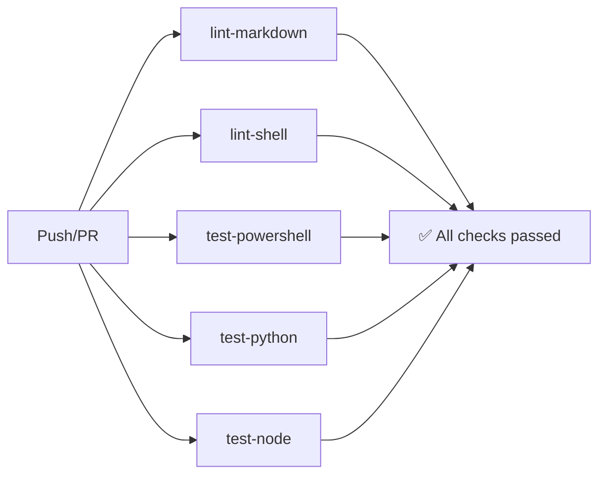

# Prompt Engineer Toolkit

> **Production-grade framework for super-prompt engineering, cross-platform automation, and AI workflow orchestration.**


---

## 📋 Table of Contents

- [Overview](#-overview)
- [Features](#-features)
- [Requirements](#-requirements)
- [Installation](#-installation)
- [Quick Start](#-quick-start)
- [Usage](#-usage)
  - [Interactive CLI](#interactive-cli)
  - [Super-Prompt Templates](#super-prompt-templates)
  - [Docker & DevContainer](#docker--devcontainer)
- [Repository Structure](#-repository-structure)
- [CI/CD Pipeline](#-cicd-pipeline)
- [Security & Best Practices](#-security--best-practices)
- [Contributing](#-contributing)
- [Dépannage](#-Dépannage)
- [License](#-license)
- [Roadmap v2.0](#-roadmap-v20)

---

## 🎯 Overview

**Prompt Engineer Toolkit** est un framework complet conçu pour les ingénieurs DevOps, les chercheurs en prompt engineering et les équipes techniques qui souhaitent industrialiser la création, l'optimisation et le déploiement de prompts pour les modèles de langage (LLM).

Ce projet fournit :
- Un **CLI interactif multiplateforme** (`PromptOps Console`) pour automatiser les tâches courantes.
- Des **templates YAML normalisés** pour générer des prompts optimisés par modèle (GPT-4, Claude 3, Gemini, Qwen).
- Une **infrastructure CI/CD prête à l'emploi** avec GitHub Actions, Pester, ShellCheck, et markdownlint.
- Un **environnement conteneurisé** via Docker et devcontainer pour une reproductibilité totale.
- Une **architecture extensible** avec support Node.js et Python pour les utilitaires avancés.

> 💡 **Public cible** : Ingénieurs DevOps confirmés, architectes cloud, chercheurs en IA, et équipes SRE.

---

## ✨ Features

### 🖥️ Interactive CLI — PromptOps Console

| Fonctionnalité | PowerShell | Bash/Zsh | Description |
| ------------- | ---------- | -------- | ----------- |
| Menu interactif | ✅ | ✅ | Navigation guidée avec couleurs et validation |
| Project Scaffold | ✅ | ✅ | Génération d'arborescence + `git init` optionnel |
| Health Check | ✅ | ✅ | Validation linting et tests locaux |
| Config persistence | ✅ | ✅ | Préférences dans `~/.promptops/config.json` |
| Flags standards | ✅ | ✅ | `--help`, `--version`, `--dry-run`, `--whatif` |

### 🧠 Super-Prompt Templates (YAML)

Templates conformes au schema [`prompts/templates/schema.yml`](prompts/templates/schema.yml) :

| Template | Objectif | Modèles cibles |
| -------- | -------- | ------------- |
| `reverse-engineering.yml` | Déduire et optimiser un prompt depuis une sortie IA | GPT, Claude, Gemini, Qwen |
| `repo-orchestration.yml` | Générer une structure de projet + CI/CD | GPT, Claude, Qwen |
| `content-pipeline.yml` | Planifier du contenu technique optimisé SEO | GPT, Gemini, Qwen |

Chaque template inclut :
- Variables typées avec validation
- Guardrails (tokens, température, prohibitions)
- Critères de qualité et tests de référence
- Adaptations spécifiques par modèle (ex: XML pour Claude, linear instructions pour Qwen)

### 🔄 CI/CD Ready (GitHub Actions)

Workflow [`ci.yml`](.github/workflows/ci.yml) avec matrix de test :

```yaml
# Plateformes : Windows, Ubuntu, macOS
# PowerShell : 5.1 (Windows uniquement), 7.4 (tous)
# Jobs :
#   • lint-markdown   → markdownlint-cli2
#   • lint-shell      → ShellCheck (severity=warning)
#   • test-powershell → Pester 5+
#   • test-python     → pytest + ruff
#   • test-node       → npm ci + npm test
```

Déclenchement automatique sur :
- Push vers `main`
- Pull Request vers `main`
- Tag `v*.*.*` → workflow `release.yml` (publication GitHub Release)

### 🐳 Containerization

**Dockerfile multi-stage** basé sur `mcr.microsoft.com/powershell:7.4-ubuntu-22.04` :

```dockerfile
# Layers :
# 1. Base : PowerShell 7.4 + outils système (git, curl, jq)
# 2. Tools : ShellCheck pour linting bash
# 3. Node : LTS via nvm + dépendances npm
# 4. Python : 3.11 + pip requirements
# 5. Final : COPY repo + ENTRYPOINT configurable (pwsh/bash)
```

**DevContainer** : Configuration VS Code prête avec extensions recommandées :
- `ms-vscode.powershell`
- `timonwong.shellcheck`
- `DavidAnson.vscode-markdownlint`
- `ms-python.python`

---

## ⚙️ Requirements

### Prérequis Système

| Plateforme | Version minimale | Notes |
| ---------- | --------------- | ----- |
| **Windows** | PowerShell 5.1 ou 7.4+ | Git for Windows recommandé |
| **macOS** | Bash 4+ ou Zsh 5+ | Installer via Homebrew si nécessaire |
| **Linux** | Bash 4+ | `shellcheck` via apt/dnf |

### Outils Recommandés (Optionnels mais conseillés)

```powershell
# PowerShell : Pester pour tests locaux
Install-Module -Name Pester -Force -SkipPublisherCheck

# macOS/Linux : ShellCheck pour validation bash
# Ubuntu/Debian
sudo apt install shellcheck
# macOS (Homebrew)
brew install shellcheck

# Markdown linting (nécessite Node.js)
npm install -g markdownlint-cli2
```

### Docker (Optionnel)

Pour une exécution isolée et reproductible :
```bash
docker --version  # 20.10+ recommandé
```

---

## 📦 Installation

### Méthode 1 : Clone Git (Recommandée)

```bash
# Cloner le repository
git clone https://github.com/valorisa/prompt-engineer-toolkit.git
cd prompt-engineer-toolkit

# (Optionnel) Configurer les hooks pre-commit
# See .github/PULL_REQUEST_TEMPLATE.md for guidelines
```

### Méthode 2 : Via Docker (Isolé)

```bash
# Construire l'image localement
docker build -t promptops:latest ./docker

# Lancer le CLI interactif
docker run -it --rm promptops:latest
```

### Méthode 3 : DevContainer (VS Code)

1. Ouvrir le dossier dans VS Code
2. Accepter la suggestion "Reopen in Container"
3. L'environnement est prêt avec toutes les dépendances

---

## 🚀 Quick Start

### Lancer le CLI Interactif

```powershell
# Windows (PowerShell)
.\scripts\PromptOpsConsole.ps1

# macOS / Linux (Bash ou Zsh)
./scripts/PromptOpsConsole.sh
```

### Exécuter en Mode Non-Interactif

```powershell
# Afficher l'aide
.\scripts\PromptOpsConsole.ps1 --help

# Afficher la version
.\scripts\PromptOpsConsole.ps1 --version

# Mode dry-run (simulation sans exécution)
.\scripts\PromptOpsConsole.ps1 --dry-run
```

### Générer un Nouveau Projet

Depuis le menu CLI → Option `[1] Project Scaffold` :

```text
>>> Project Scaffold
Repository name? my-ai-agent
Visibility (public/private)? public
Include CI/CD scaffolding? (y/n) y
Runtimes to include: pwsh/node/python/all? all
Initialize git and create first commit? (y/n) y

Summary:
  Name: my-ai-agent
  Visibility: public
  CI/CD: y
  Runtimes: all
  Git Init: y

Confirm execution? (y/n) y
```

→ Le script crée l'arborescence, initialise Git, et commit le premier snapshot.

---

## 📖 Usage

### Interactive CLI

Le menu principal offre 6 modules :

```text
PromptOps Console v1.0.0
------------------------------------------
[1] Project Scaffold     - New repo setup
[2] Automation Engine    - CI/CD & scripts
[3] Docs Generator       - README, guides
[4] Super-Prompt Studio  - Create/optimize
[5] Health Check         - Lint & validate
[6] Settings             - Config & prefs
[0] Exit
------------------------------------------
```

Chaque option déclenche un questionnaire guidé (≥4 questions) avec :
- Validation des entrées
- Résumé des choix
- Confirmation avant exécution
- Support `--whatif` pour prévisualisation

### Super-Prompt Templates

Utilisez les templates YAML avec votre LLM préféré :

```yaml
# Exemple : prompts/templates/reverse-engineering.yml
meta:
  id: reverse-engineering-v1
  target_models: [gpt, claude, gemini, qwen]

prompt:
  system: |
    You are an expert in reverse prompt engineering...
  user_template: |
    Analyze this AI output and reverse-engineer its prompt.
    Target model: {{target_model}}
    Output to analyze: """{{ai_output}}"""

variables:
  - name: target_model
    type: enum
    options: [gpt, claude, gemini, qwen]
```

> 💡 **Astuce Qwen** : Pour de meilleurs résultats avec Qwen, privilégiez des instructions linéaires, placez les règles critiques en début de prompt, et utilisez des marqueurs bilingues si nécessaire.

### Docker & DevContainer

#### Build Local

```bash
cd docker
docker build -t promptops-toolkit:latest .
```

#### Run Interactive

```bash
# Mode PowerShell
docker run -it --rm -v ${PWD}:/app promptops-toolkit:latest pwsh

# Mode Bash
docker run -it --rm -v ${PWD}:/app promptops-toolkit:latest bash
```

#### DevContainer (VS Code)

La configuration `.devcontainer/devcontainer.json` installe automatiquement :
- PowerShell 7.4
- ShellCheck
- markdownlint
- Python 3.11 + Pester

---

## 🗂️ Repository Structure

```text
prompt-engineer-toolkit/
├── .github/
│   ├── workflows/
│   │   ├── ci.yml          # Matrix CI: lint + test multi-OS
│   │   └── release.yml     # Auto-publish on tag v*.*.*
│   ├── ISSUE_TEMPLATE/
│   │   └── bug_report.md   # Template standardisé
│   └── PULL_REQUEST_TEMPLATE.md  # Checklist de review
├── scripts/
│   ├── PromptOpsConsole.ps1    # CLI PowerShell (5.1/7+)
│   ├── PromptOpsConsole.sh     # CLI Bash/Zsh (POSIX)
│   ├── node/
│   │   ├── promptops.js        # Utilitaire Node.js
│   │   └── package.json
│   └── python/
│       ├── promptops.py        # Utilitaire Python
│       └── requirements.txt
├── prompts/
│   └── templates/
│       ├── reverse-engineering.yml  # Template: reverse prompt
│       ├── repo-orchestration.yml   # Template: scaffolding
│       ├── content-pipeline.yml     # Template: content planning
│       └── schema.yml               # Reference schema
├── docker/
│   └── Dockerfile              # Multi-stage build
├── .devcontainer/
│   └── devcontainer.json       # VS Code remote config
├── tests/
│   ├── PromptOpsConsole.Tests.ps1  # Pester tests
│   └── test_promptops.py           # pytest tests
├── docs/
│   ├── ARCHITECTURE.md         # Décisions techniques & sécurité
│   ├── USAGE.md                # Guide utilisateur détaillé
│   └── SUPER-PROMPT-SPEC.md    # Spécifications des templates
├── .shellcheckrc               # Config ShellCheck (severity=warning)
├── .markdownlint.json          # Config markdownlint (MD013=off, etc.)
├── README.md                   # Ce fichier
├── CONTRIBUTING.md             # Guide de contribution
├── CODE_OF_CONDUCT.md          # Engagement communautaire
└── LICENSE                     # MIT License
```

---

## 🔄 CI/CD Pipeline

### Workflow `ci.yml`

Déclenché sur `push`/`pull_request` vers `main` :



| Job | Commande | Outil | Plateformes |
| --- | -------- | ----- | ----------- |
| `lint-markdown` | `npx markdownlint-cli2 "**/*.md"` | markdownlint | Ubuntu |
| `lint-shell` | `shellcheck scripts/*.sh` | ShellCheck | Ubuntu |
| `test-powershell` | `Invoke-Pester ./tests -CI` | Pester 5+ | Win/Ubuntu/macOS |
| `test-python` | `pytest && ruff check` | pytest + ruff | Ubuntu |
| `test-node` | `npm ci && npm test` | npm | Ubuntu |

### Workflow `release.yml`

Déclenché sur tag `v*.*.*` :

1. Build des artefacts (`prompts/`, `scripts/`)
2. Génération du changelog depuis les commits
3. Création d'une GitHub Release avec :
   - Archive `.zip` des templates et scripts
   - Notes de version auto-générées
   - Assets binaires optionnels

---

## 🔐 Security & Best Practices

### Gestion des Secrets

⚠️ **Règle absolue** : Aucun secret, token ou credential ne doit être hardcodé.

| Type | Méthode recommandée | Exemple |
| ---- | ------------------- | ------- |
| GitHub Token | GitHub Secrets | `${{ secrets.GITHUB_TOKEN }}` |
| API Key | Variable d'environnement | `$env:OPENAI_API_KEY` |
| Config sensible | Fichier `.env` ignoré par Git | `.gitignore` inclut `.env` |

Documentation détaillée dans [`docs/ARCHITECTURE.md`](docs/ARCHITECTURE.md).

### Bonnes Pratiques de Développement

1. **Tests avant commit** :
   ```powershell
   # PowerShell
   Invoke-Pester ./tests -CI

   # Bash
   shellcheck scripts/PromptOpsConsole.sh

   # Markdown
   npx markdownlint-cli2 "**/*.md"
   ```

2. **Dry-run pour les opérations destructives** :
   ```powershell
   .\scripts\PromptOpsConsole.ps1 --whatif
   ```

3. **Validation cross-platform** :
   - Tester sur Windows PS5.1, PS7+, macOS Zsh, Linux Bash avant merge.

4. **Code Review** :
   - Respecter la checklist de [`PULL_REQUEST_TEMPLATE.md`](.github/PULL_REQUEST_TEMPLATE.md).

---

## 🤝 Contributing

Nous accueillons les contributions ! Veuillez suivre ces étapes :

1. **Fork** le repository et créer une branche feature :
   ```bash
   git checkout -b feature/ma-nouvelle-fonctionnalite
   ```

2. **Implémenter** avec tests associés :
   - Ajouter des tests Pester/pytest pour toute nouvelle logique.
   - Mettre à jour la documentation si le comportement change.

3. **Valider localement** :
   ```bash
   # Linting
   shellcheck scripts/*.sh
   npx markdownlint-cli2 "**/*.md"

   # Tests
   Invoke-Pester ./tests
   pytest tests/
   ```

4. **Soumettre une Pull Request** :
   - Lier à une issue existante ou en créer une nouvelle.
   - Remplir le template de PR avec description et checklist.

5. **Review & Merge** :
   - Un mainteneur validera les changements après approbation CI.

> 📚 Lire [`CONTRIBUTING.md`](CONTRIBUTING.md) pour plus de détails.

---

## 🔧 Dépannage

### Problèmes d'Encodage sous Windows (Erreur cp1252)

#### Description du Problème

Lors de la génération de digests de repository via la commande **'gitingest.exe'** ou de la lecture de fichiers encodés en UTF-8 avec Python sous Windows, vous pouvez rencontrer l'erreur suivante :

```text
Error reading file with 'cp1252': 'charmap' codec can't decode byte 0x8f in position 2106: character maps to <undefined>
```

Cette erreur affecte les fichiers contenant :
- Des caractères spéciaux UTF-8 (accents, émojis, symboles comme ✓, ⚠, →)
- Des caractères non-ASCII de contributeurs internationaux
- Des fichiers Markdown avec formatage spécial

#### Cause Racine

| Composant | Comportement |
| --------- | -------- |
| **Python sous Windows** | Utilise l'encodage système `cp1252` (Europe occidentale) par défaut quand aucun encodage n'est spécifié |
| **Fichiers du Repository** | Encodés en UTF-8 (standard GitHub) |
| **Outils comme `gitingest.exe`** | Peuvent ne pas spécifier l'encodage explicitement lors de la lecture des fichiers |
| **PowerShell 5.1/7+** | Écrit correctement en UTF-8, mais Python lit avec le mauvais encodage |

```python
# ❌ Code problématique (utilise cp1252 par défaut sous Windows)
with open('README.md', 'r') as f:
    content = f.read()

# ✅ Code correct (UTF-8 explicite)
with open('README.md', 'r', encoding='utf-8') as f:
    content = f.read()
```

#### Solution

Un script Python dédié `generate_digest.py` est fourni à la racine du repository pour générer des digests avec une gestion correcte de l'encodage UTF-8.

**Fonctionnalités Clés :**
- `encoding='utf-8'` explicite sur toutes les opérations de lecture de fichiers
- `encoding='utf-8'` explicite sur toutes les opérations d'écriture de fichiers
- Gestion gracieuse des fichiers binaires ou non-UTF-8
- Compatible multiplateforme (Windows, macOS, Linux)

#### Utilisation

```powershell
# Générer un digest complet du repository
python .\generate_digest.py . digest.txt

# Spécifier un fichier de sortie personnalisé
python .\generate_digest.py . mon-digest.txt

# Vérifier l'absence d'erreurs d'encodage dans la sortie
Select-String -Path .\digest.txt -Pattern "Error reading file with"
# Ne doit retourner aucun résultat si tous les fichiers ont été lus correctement
```

#### Emplacement du Script

```text
prompt-engineer-toolkit/
└── generate_digest.py    # Générateur de digest sécurisé UTF-8
```

#### Bonnes Pratiques de Prévention

| Pratique | Implémentation |
| -------- | -------------- |
| **Toujours spécifier l'encodage** | `open(file, 'r', encoding='utf-8')` dans les scripts Python |
| **Utiliser UTF-8 sans BOM** | Standard pour les fichiers `.md`, `.yml`, `.json`, `.sh` |
| **UTF-8 avec BOM pour PowerShell** | Les fichiers `.ps1` peuvent bénéficier du BOM pour la compatibilité PS5.1 |
| **Définir la variable d'environnement** | `$env:PYTHONIOENCODING = "utf-8"` avant d'exécuter des scripts Python |
| **Utiliser l'outillage fourni** | Préférer `generate_digest.py` aux outils externes comme `gitingest.exe` |

#### Fichiers Associés

| Fichier | Objectif |
| ---- | ------- |
| `generate_digest.py` | Générateur de digest sécurisé UTF-8 (fourni) |
| `scripts/python/promptops.py` | Exemple d'utilisation correcte de l'encodage dans les scripts du projet |
| `docs/ARCHITECTURE.md` | Documente les standards d'encodage pour le projet |

> **Note** : Ce problème est spécifique à Windows. macOS et Linux utilisent UTF-8 par défaut, donc l'erreur ne se produit pas sur ces plateformes. Cependant, le script fourni assure une cohérence multiplateforme.

#### Exemple Concret Rencontré dans ce Projet

**Contexte** : Génération du fichier `digest.txt` avec l'outil `gitingest.exe` sous PowerShell 7.4

**Erreur** :
```text
FILE: README.md
================================================
Error reading file with 'cp1252': 'charmap' codec can't decode byte 0x8f in position 2106
```

**Résolution** :
1. Création du script `generate_digest.py` avec encodage UTF-8 explicite
2. Régénération du digest sans erreurs
3. Documentation du problème dans cette section pour référence future

**Commande de Vérification** :
```powershell
# Après correction, cette commande ne doit retourner aucune erreur
Select-String -Path .\digest.txt -Pattern "Error reading file with"
```

---

## 📜 License

Distribué sous licence **MIT**. Voir [`LICENSE`](LICENSE) pour le texte complet.

```text
MIT License

Copyright (c) 2024 prompt-engineer-toolkit

Permission is hereby granted, free of charge, to any person obtaining a copy
of this software and associated documentation files (the "Software"), to deal
in the Software without restriction, including without limitation the rights
to use, copy, modify, merge, publish, distribute, sublicense, and/or sell
copies of the Software, and to permit persons to whom the Software is
furnished to do so, subject to the following conditions:

The above copyright notice and this permission notice shall be included in all
copies or substantial portions of the Software.

THE SOFTWARE IS PROVIDED "AS IS", WITHOUT WARRANTY OF ANY KIND...
```

---

## 🗓️ Roadmap v2.0

Fonctionnalités planifiées pour la prochaine version majeure :

| Feature | Description | Priorité |
| ------- | ----------- | -------- |
| 🔌 Plugin Architecture | Extension dynamique des menus CLI via modules externes | Haute |
| 📊 Telemetry Opt-in | Métriques d'usage anonymisées pour améliorer l'outil | Moyenne |
| 🔐 Script Signing | Signature PowerShell pour déploiements enterprise | Haute |
| 🤖 Model Router | Routage intelligent vers le meilleur LLM selon le prompt | Moyenne |
| 🌐 i18n Support | Internationalisation complète du CLI (FR, ES, DE, etc.) | Basse |

> 💬 Vous avez une idée pour v2.0 ? Ouvrez une [Discussion](https://github.com/valorisa/prompt-engineer-toolkit/discussions) ou une [Issue](https://github.com/valorisa/prompt-engineer-toolkit/issues).

---

## 🆘 Support & Community

- 🐛 **Bug Report** : [New Issue](https://github.com/valorisa/prompt-engineer-toolkit/issues/new?template=bug_report.md)
- 💡 **Feature Request** : [New Discussion](https://github.com/valorisa/prompt-engineer-toolkit/discussions)
- 📖 **Documentation** : [`docs/`](docs/)
- 🔄 **Changelog** : Voir les [Releases](https://github.com/valorisa/prompt-engineer-toolkit/releases)

---

> ⭐ **Si ce projet vous est utile, merci de mettre une étoile** — cela aide la communauté à le découvrir !
