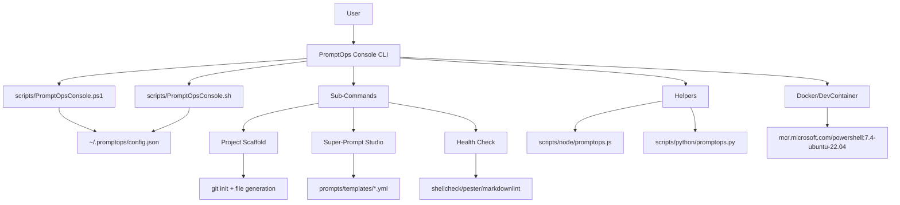

# Architecture Overview

> Technical decisions, security model, and CI/CD flow for `prompt-engineer-toolkit`.

---

## Table of Contents

1. [Design Principles](#design-principles)
2. [Security Model](#security-model)
3. [Component Architecture](#component-architecture)
4. [CI/CD Pipeline](#cicd-pipeline)
5. [Cross-Platform Strategy](#cross-platform-strategy)
6. [Extensibility & v2 Roadmap](#extensibility--v2-roadmap)

---

## Design Principles

| Principle | Rationale |
|-----------|-----------|
| **Zero Secrets in Code** | Prevent credential leaks; enforce GitHub Secrets + env vars only. |
| **Idempotent Operations** | Scripts safe to re-run; no side effects on repeated execution. |
| **Fail Fast, Log Clearly** | Early validation with actionable error messages. |
| **Model-Agnostic Templates** | YAML schema abstracts LLM differences; adaptations handled per-model. |
| **Progressive Enhancement** | Core CLI works everywhere; advanced features require additional tools. |

---

## Security Model

### Secrets Management

```text
✅ Allowed:
- GitHub Actions secrets: ${{ secrets.GITHUB_TOKEN }}
- Environment variables: $env:API_KEY, $API_KEY
- User config: ~/.promptops/config.json (excluded from Git)

❌ Forbidden:
- Hardcoded tokens in scripts
- Committed .env files
- Inline credentials in YAML templates
```

**Implementation**:

- All scripts reference secrets via env vars only.
- `.gitignore` explicitly excludes `*.env`, `*.secret`, `config.json`.
- CI workflows use `secrets` context; never echo sensitive values.

### Script Integrity

| Platform | Mechanism | Status |
|----------|-----------|--------|
| **PowerShell** | ExecutionPolicy Bypass (dev); Code Signing (prod v2) | Dev-ready |
| **Bash/Zsh** | `set -euo pipefail`; `trap EXIT` for cleanup | Implemented |
| **Docker** | Non-root user (TODO v2); multi-stage build minimizes attack surface | Partial |

### Input Validation

- CLI: All user inputs validated before execution (type, enum, length).
- YAML Templates: Schema validation via `prompts/templates/schema.yml` (TODO v2: add JSON Schema enforcement).
- CI: Linting jobs block merges on warnings (ShellCheck severity=warning).

---

## Component Architecture



### CLI Core (`PromptOpsConsole.*`)

| Feature | PowerShell | Bash/Zsh |
|---------|------------|----------|
| Version detection | `$PSVersionTable.PSVersion` | `$BASH_VERSION`, `$ZSH_VERSION` |
| Strict mode | `Set-StrictMode -Version Latest` | `set -euo pipefail` |
| Cleanup | `try/finally` | `trap EXIT cleanup` |
| Color output | `$Host.UI.RawUI.ForegroundColor` | ANSI escape codes |
| Config persistence | `ConvertTo-Json`/`ConvertFrom-Json` | `jq` or pure bash parsing |

### Helper Scripts

- **Node.js** (`scripts/node/promptops.js`): Lightweight YAML/JSON validation stubs.
- **Python** (`scripts/python/promptops.py`): Advanced template rendering, secret scanning (TODO v2).

### Prompt Templates

- Schema-enforced YAML in `prompts/templates/`.
- Variables interpolated via `{{mustache}}` syntax (LLM-side substitution).
- Model adaptations documented in `model_adaptations` block.

---

## CI/CD Pipeline

### Workflow `ci.yml`

```yaml
# Trigger
on:
  push: { branches: [main] }
  pull_request: { branches: [main] }

# Matrix Strategy
strategy:
  matrix:
    os: [windows-latest, ubuntu-latest, macos-latest]
    pwsh: [5.1, 7.4]  # 5.1 excluded on non-Windows via `exclude`

# Jobs
jobs:
  lint-markdown:  # ubuntu-latest
  lint-shell:     # ubuntu-latest + ShellCheck
  test-powershell: # matrix: os × pwsh
  test-python:    # ubuntu-latest + pytest/ruff
  test-node:      # ubuntu-latest + npm
```

**Failure Policy**: Any job failure blocks merge. Warnings from ShellCheck (`severity=warning`) also block.

### Workflow `release.yml`

Triggered on tag `v*.*.*`:

1. Checkout code.
2. Package `prompts/` and `scripts/` into `.zip`.
3. Generate changelog from commits since last tag.
4. Create GitHub Release with:
   - Title: `v1.0.0`
   - Body: Auto-generated changelog
   - Assets: `prompt-engineer-toolkit-v1.0.0.zip`

---

## Cross-Platform Strategy

| Feature | Windows PS5.1 | Windows PS7+ | macOS Zsh | Linux Bash |
|---------|--------------|--------------|-----------|------------|
| CLI Menu | ✅ | ✅ | ✅ | ✅ |
| Project Scaffold | ✅ | ✅ | ✅ | ✅ |
| Git Integration | ✅ (Git for Windows) | ✅ | ✅ | ✅ |
| Color Output | ✅ (Console) | ✅ (Terminal) | ✅ | ✅ |
| `--whatif` Support | ✅ | ✅ | ❌ (TODO v2) | ❌ (TODO v2) |
| Config Persistence | ✅ | ✅ | ✅ | ✅ |

**Fallback Logic**:

- If `jq` unavailable, Bash CLI uses pure bash JSON parsing (limited).
- If `git` unavailable, scaffold skips git init with warning.

---

## Extensibility & v2 Roadmap

### Plugin Architecture (Planned)

```text
plugins/
├── scaffold-azure/      # Azure-specific scaffolding
├── prompt-analyzer/     # Advanced prompt quality metrics
└── telemetry-collector/ # Anonymous usage metrics (opt-in)
```

- Plugins discovered via `~/.promptops/plugins/`.
- Loaded dynamically at CLI startup (TODO v2).

### Telemetry (Opt-In)

- Metrics collected: CLI version, OS, command invoked (no user data).
- Sent to anonymous endpoint (configurable).
- Disabled by default; enabled via `config.json: { "telemetry": true }`.

### Script Signing (Enterprise)

- PowerShell: Authenticode signing for production deployments.
- Bash: Notarization via Apple codesign (macOS) — research phase.

---

## TODO(v2)

- [ ] Implement JSON Schema validation for `prompts/templates/*.yml`.
- [ ] Add non-root user to Dockerfile for security hardening.
- [ ] Support `--dry-run` and `--whatif` in Bash/Zsh CLI.
- [ ] Implement plugin discovery and loading architecture.
- [ ] Add telemetry opt-in with anonymized metrics collection.
- [ ] Research and implement PowerShell script signing workflow.

---
